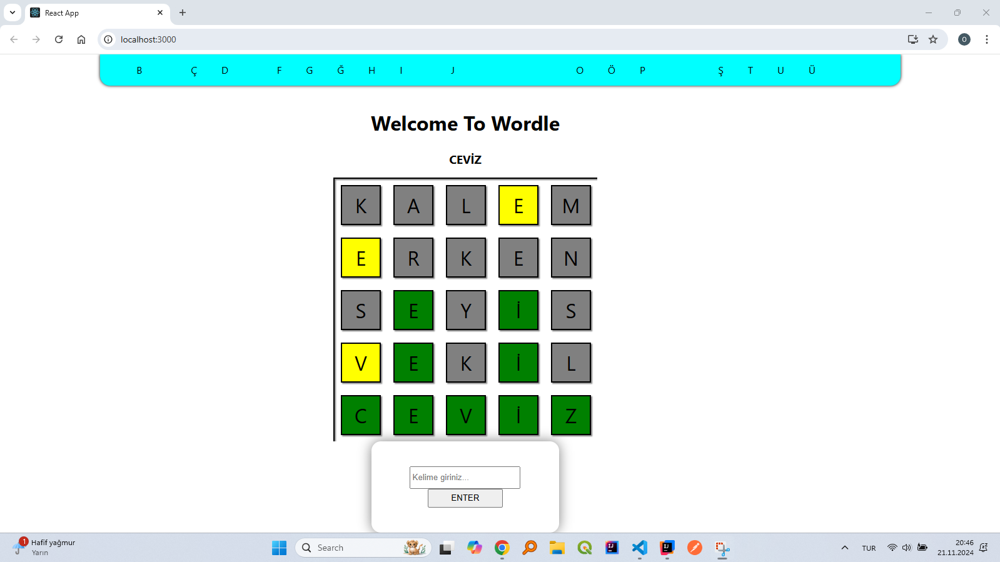

# KURALLAR VE OYNANIŞ 

### 1 - Oyuncular kelime havuzundan rastgele gelen kelimeyi doğru tahmin etmek için 5 hakka sahiptir.

### 2 - Seçilen kelime alttaki kutucuğa yazılır ve "Enter" tuşu veya fare komutu ile tahmin gönderilir.

### 3- Oyuncunun yanlış tahmin ettiği harfler ekranda gri renkle görünür. Yeşil renkler doğru harfi ve doğru yeri ifade eder.Sarı renk ise doğru harfi ancak yanlış yeri ifade eder.

### 4 - Oyuncunun kullanmış olduğu harfler yukarıdaki şeritten kaldırılır ve oyuncuya yeni tahminlerinde yardımcı olur.

### 5 - Oyun son tahmin hakkına kadar bu şekilde devam eder. Oyun sonlandığında doğru cevap ekranda gözükür.

